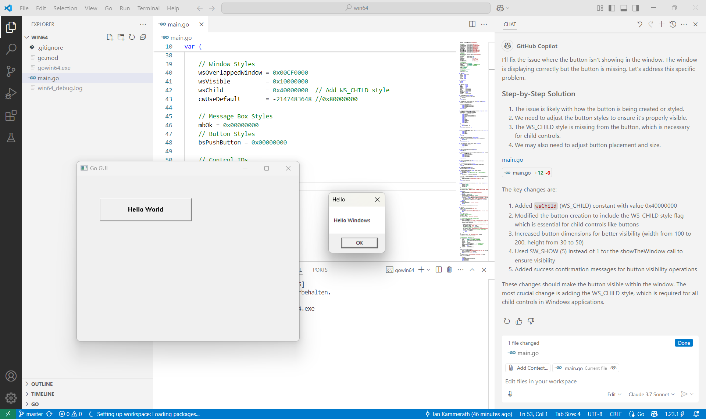
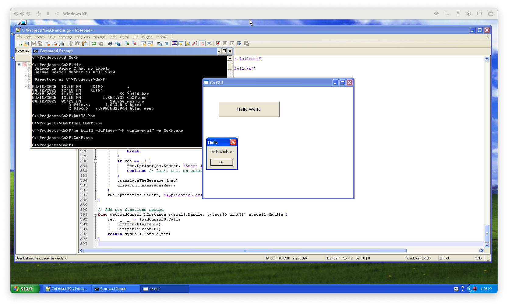

# Native Windows GUIs with Go

This sample application shows how to create native Windows GUIs with Go using the `kernel32.dll` and `user32.dll` kernel modules of Windows XP, Vista, 7, 8, 10 and 11.

## Windows XP SP3 with Go 1.10

The provided source heavily relies on syscalls and thus works on Windows versions as old as Windows XP.

